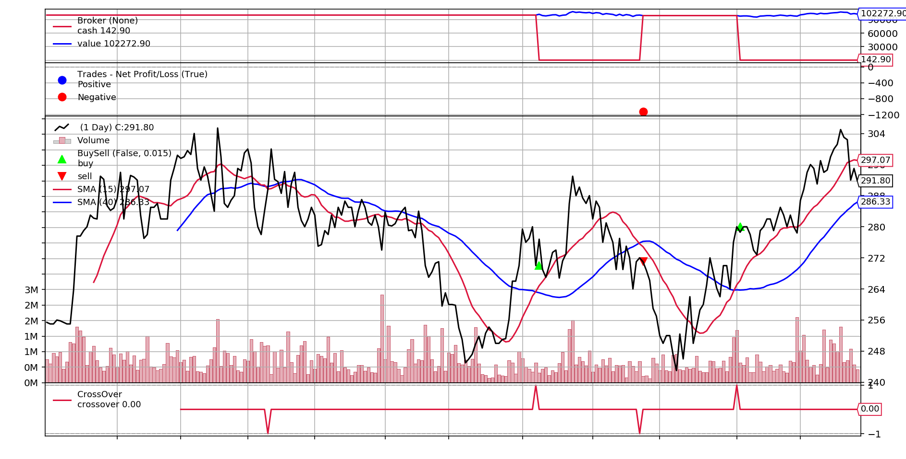
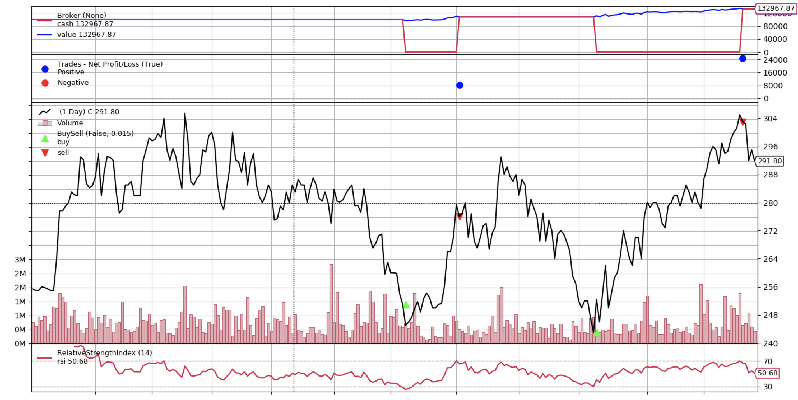
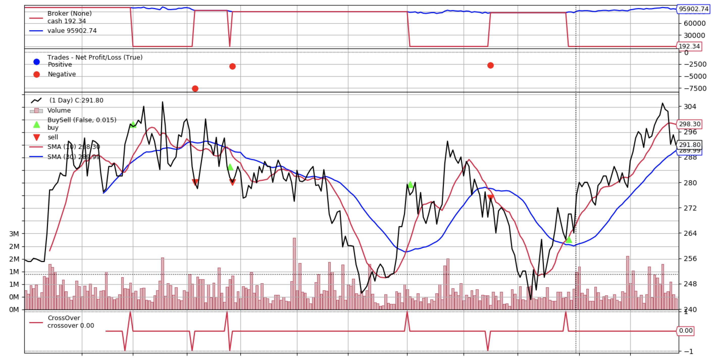
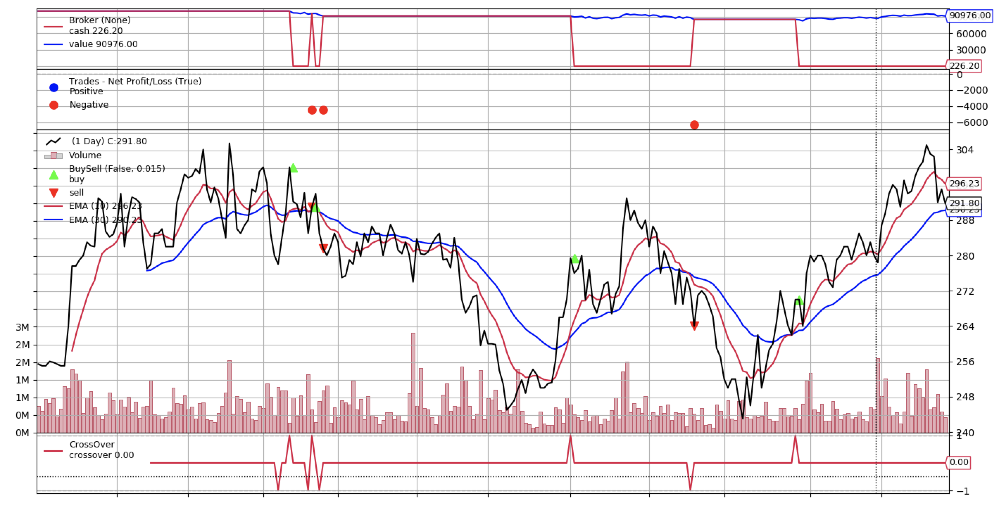
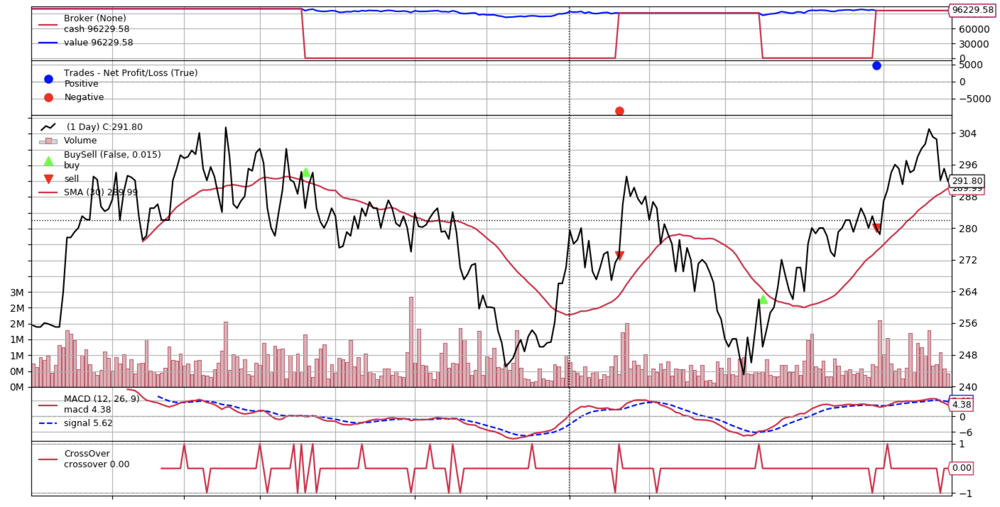
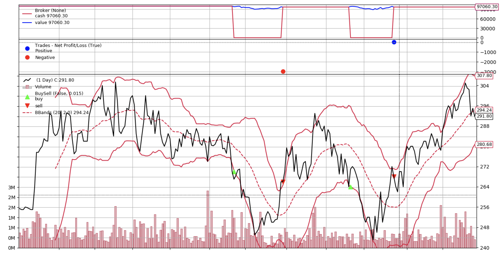
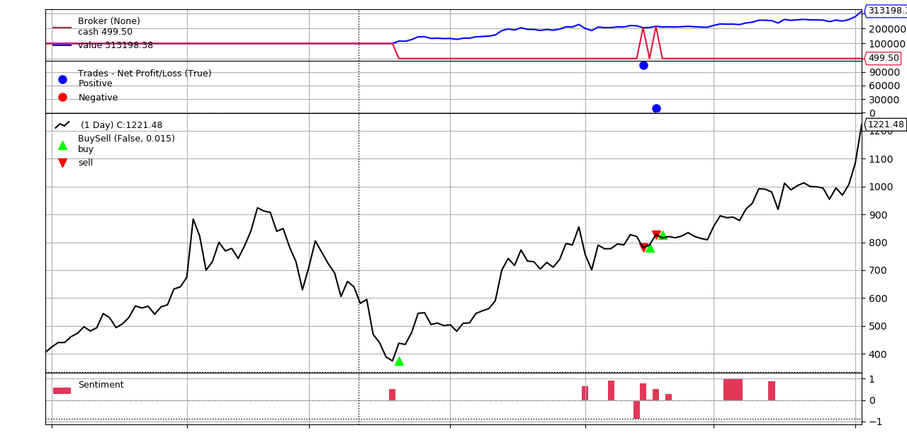

# fastquant :nerd_face:
[](https://travis-ci.com/enzoampil/fastquant)
[](https://github.com/ambv/black)
[](https://raw.githubusercontent.com/enzoampil/fastquant/master/LICENSE)

## Bringing backtesting to the mainstream

**fastquant** allows you to easily backtest investment strategies with as few as 3 lines of python code. Its goal is to promote data driven investments by making quantitative analysis in finance accessible to everyone.

## Features
1. Easily access historical stock data
2. Backtest and optimize trading strategies with only 3 lines of code

<sup>`*` - Both Yahoo Finance and Philippine stock data data are accessible straight from fastquant<sup>

## Installation

### Python

```
pip install fastquant
```

### R

R support is pending development, but you may install the R package by typing the following 

```
# install.packages("remotes")

remotes::install_github("enzoampil/fastquant", subdir = "R")
```

## Get stock data
All symbols from [Yahoo Finance](https://finance.yahoo.com/) and Philippine Stock Exchange ([PSE](https://www.pesobility.com/stock)) are accessible via `get_stock_data`.

### Python

```
from fastquant import get_stock_data
df = get_stock_data("JFC", "2018-01-01", "2019-01-01")
print(df.head())

#           dt  close
#   2019-01-01  293.0
#   2019-01-02  292.0
#   2019-01-03  309.0
#   2019-01-06  323.0
#   2019-01-07  321.0
```

### R

```
library(fastquant)

get_pse_data("JFC", "2018-01-01", "2019-01-01")
```

*Note: Python has Yahoo Finance and phisix support. R only has phisix support. Symbols from Yahoo Finance will return closing prices in USD, while symbols from PSE will return closing prices in PHP*

## Get crypto data
The data is pulled from Binance, and all the available tickers are found [here](https://coinmarketcap.com/exchanges/binance/).

```
from fastquant import get_crypto_data
crypto = get_crypto_data("BTC/USDT", "2018-12-01", "2019-12-31")
crypto.head()

#             open    high     low     close    volume
# dt                                                          
# 2018-12-01  4041.27  4299.99  3963.01  4190.02  44840.073481
# 2018-12-02  4190.98  4312.99  4103.04  4161.01  38912.154790
# 2018-12-03  4160.55  4179.00  3827.00  3884.01  49094.369163
# 2018-12-04  3884.76  4085.00  3781.00  3951.64  48489.551613
# 2018-12-05  3950.98  3970.00  3745.00  3769.84  44004.799448
```

## Backtest trading strategies

*Note: Support for backtesting in R is pending*

### Simple Moving Average Crossover (15 day MA vs 40 day MA)
Daily Jollibee prices from 2018-01-01 to 2019-01-01
```
from fastquant import backtest
backtest('smac', df, fast_period=15, slow_period=40)

# Starting Portfolio Value: 100000.00
# Final Portfolio Value: 102272.90
```


## Optimize trading strategies with automated grid search

### Simple Moving Average Crossover (15 to 30 day MA vs 40 to 55 day MA)
Daily Jollibee prices from 2018-01-01 to 2019-01-01

```
from fastquant import backtest
res = backtest("smac", df, fast_period=range(15, 30, 3), slow_period=range(40, 55, 3), verbose=False)

# Optimal parameters: {'init_cash': 100000, 'buy_prop': 1, 'sell_prop': 1, 'execution_type': 'close', 'fast_period': 15, 'slow_period': 40}
# Optimal metrics: {'rtot': 0.022, 'ravg': 9.25e-05, 'rnorm': 0.024, 'rnorm100': 2.36, 'sharperatio': None, 'pnl': 2272.9, 'final_value': 102272.90}

print(res[['fast_period', 'slow_period', 'final_value']].head())

#	fast_period	slow_period	final_value
#0	15	        40	        102272.90
#1	21	        40	         98847.00
#2	21	        52	         98796.09
#3	24	        46	         98008.79
#4	15	        46	         97452.92

```


## Library of trading strategies

| Strategy | Alias | Parameters |
| --- | --- | --- |
| Relative Strength Index (RSI) | rsi | `rsi_period`, `rsi_upper`,  `rsi_lower` |
| Simple moving average crossover (SMAC) | smac | `fast_period`, `slow_period` |
| Exponential moving average crossover (EMAC) | emac | `fast_period`, `slow_period` |
| Moving Average Convergence Divergence (MACD) | macd | `fast_perod`, `slow_upper`, `signal_period`, `sma_period`, `sma_dir_period` |
| Bollinger Bands | bbands | `period`, `devfactor` |
| Buy and Hold | buynhold | `N/A` |
| Sentiment Strategy | sentiment | `keyword` , `page_nums`, `senti` |

### Relative Strength Index (RSI) Strategy
```
backtest('rsi', df, rsi_period=14, rsi_upper=70, rsi_lower=30)

# Starting Portfolio Value: 100000.00
# Final Portfolio Value: 132967.87
```


### Simple moving average crossover (SMAC) Strategy
```
backtest('smac', df, fast_period=10, slow_period=30)

# Starting Portfolio Value: 100000.00
# Final Portfolio Value: 95902.74
```


### Exponential moving average crossover (EMAC) Strategy
```
backtest('emac', df, fast_period=10, slow_period=30)

# Starting Portfolio Value: 100000.00
# Final Portfolio Value: 90976.00
```


### Moving Average Convergence Divergence (MACD) Strategy
```
backtest('macd', df, fast_period=12, slow_period=26, signal_period=9, sma_period=30, dir_period=10)

# Starting Portfolio Value: 100000.00
# Final Portfolio Value: 96229.58
```


### Bollinger Bands Strategy
```
backtest('bbands', df, period=20, devfactor=2.0)

# Starting Portfolio Value: 100000.00
# Final Portfolio Value: 97060.30
```


### News Sentiment Strategy
Use Tesla (TSLA) stock from yahoo finance and news articles from [Business Times](https://www.businesstimes.com.sg/)
```
from fastquant import get_yahoo_data, get_bt_news_sentiment
data = get_yahoo_data("TSLA", "2020-01-01", "2020-07-04")
sentiments = get_bt_news_sentiment(keyword="tesla", page_nums=3)
backtest("sentiment", data, sentiments=sentiments, senti=0.2)

# Starting Portfolio Value: 100000.00
# Final Portfolio Value: 313198.37
```


### Multi Strategy

Multiple registered strategies can be utilized together in an OR fashion, where buy or sell signals are applied when at least one of the strategies trigger them.

```
df = get_stock_data("JFC", "2018-01-01", "2019-01-01")

# Utilize single set of parameters
strats = { 
    "smac": {"fast_period": 35, "slow_period": 50}, 
    "rsi": {"rsi_lower": 30, "rsi_upper": 70} 
} 
res = backtest("multi", df, strats=strats)
res.shape
# (1, 16)


# Utilize auto grid search
strats_opt = { 
    "smac": {"fast_period": 35, "slow_period": [40, 50]}, 
    "rsi": {"rsi_lower": [15, 30], "rsi_upper": 70} 
} 

res_opt = backtest("multi", df, strats=strats_opt)
res_opt.shape
# (4, 16)
```

See more examples [here](https://nbviewer.jupyter.org/github/enzoampil/fastquant/tree/master/examples/).
